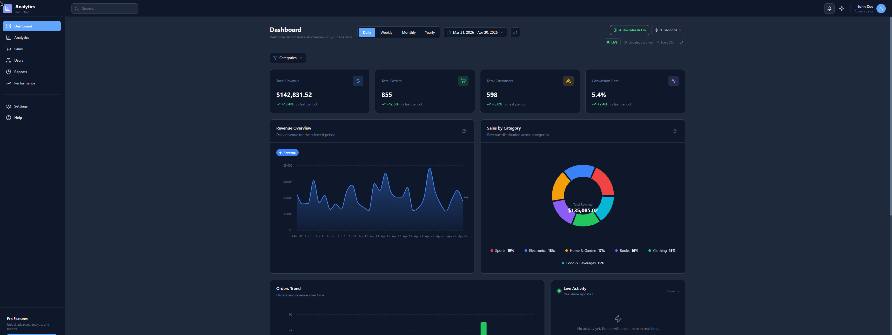
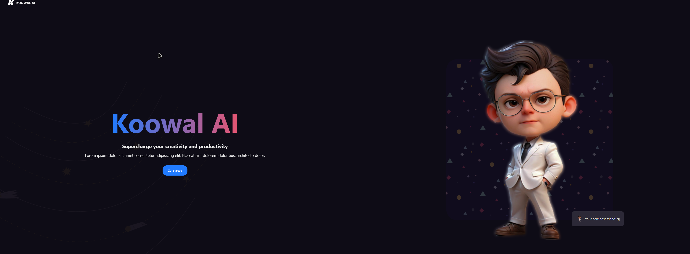

<h1 align="center">
</h1>

<b>Fullstack JavaScript Developer</b> focused on React and Node.js. I build web applications with real-time features, authentication systems and scalable REST APIs. Interested in product development, performance optimization, user-focused SaaS applications and modern frontend architecture.

🎯 Currently seeking: Frontend/Full-Stack Developer opportunities 
📍 Location: Gdańsk, Poland | Open to remote work 
⚡ Fun fact: I've deployed all my projects to production and they actually work!

    

<h1 align="center"> Let's Connect</h1>

  
  
  
  

    

<h1 align="center">  Tech Stack </h1>

<h4 align="center"> Programming Languages: </h4>

  

<h4 align="center"> Front-end: </h4>

  

<h4 align="center"> Back-end: </h4>

 

<h4 align="center"> Databases: </h4>

<h4 align="center"> Tools: </h4>

    

<h1 align="center">  GitHub Stats </h1>

                                                                                                                                  
<table border="0">
<tr border="0">
<td width="50%" align="center">

</td> 
<td width="50%" align="center">

</td>
</tr>
</table>

    

<h1 align="center">  Featured Projects </h1>

<table>
  <tr>
    <td width="50%">
      <h3>Coinly</h3>
      
      
Full-stack finance manager - budgets, savings goals, recurring transactions via cron jobs.

      
<strong>React · Node.js · Express · MySQL · JWT</strong>

      <a href="https://coinly-1.onrender.com">🌐 Live</a> •
      <a href="https://github.com/Koooowal/coinly-finance-manager">📁 Repo</a>
    </td>
    <td width="50%">
      <h3>Dashboard Analytics</h3>
      
      
Analytics dashboard with 8 chart types, real-time data and CSV/PDF export.

      
<strong>React · TypeScript · Tailwind · Recharts · Zustand</strong>

      <a href="https://dashboard-analytics-app-frontend.onrender.com">🌐 Live</a> •
      <a href="https://github.com/Koooowal/dashboard-analitycs">📁 Repo</a>
    </td>
  </tr>
  <tr>
    <td width="50%">
      <h3>KoowalAI ChatBot</h3>
      
      
AI chatbot with real-time streaming, image analysis powered by Google Gemini 1.5 Flash.

      
<strong>React · Node.js · MongoDB · Gemini AI · Clerk</strong>

       <a href="https://koowalai-chatbot-fullstack-frontend.onrender.com">🌐 Live</a> •
      <a href="https://github.com/Koooowal/ai-chatbot">📁 Repo</a>
    </td>
    <td width="50%">
      <h3> Project Management App</h3>
      
      
Full-stack project manager with real git workflow — PRs, issues, sprints.

      
<strong>Next.js · TypeScript · Prisma · MongoDB</strong>

      <a href="https://github.com/Koooowal/poject-management-app">📁 Repo</a>
    </td>
  </tr>
</table>

